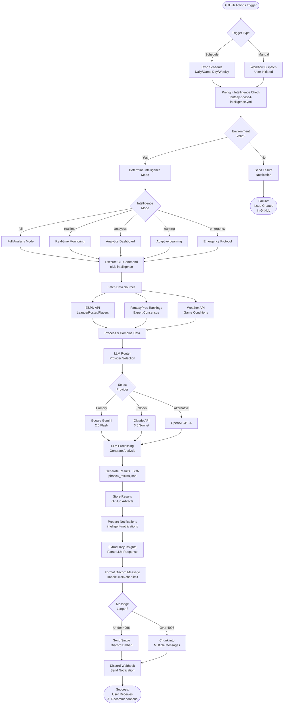
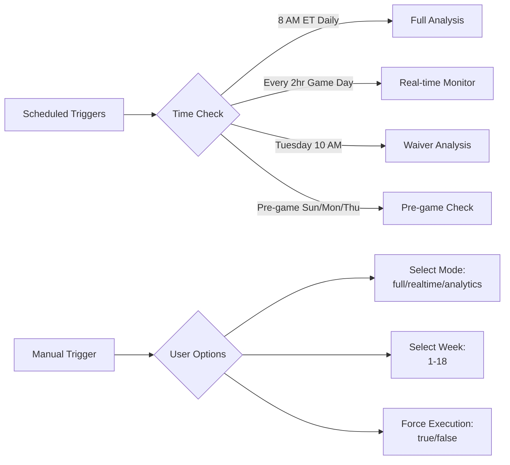
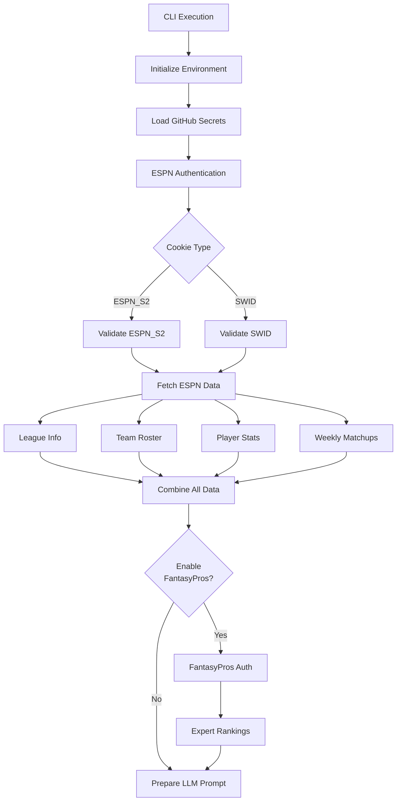
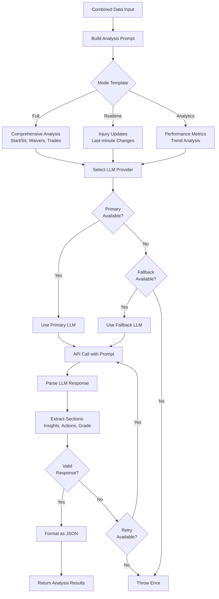
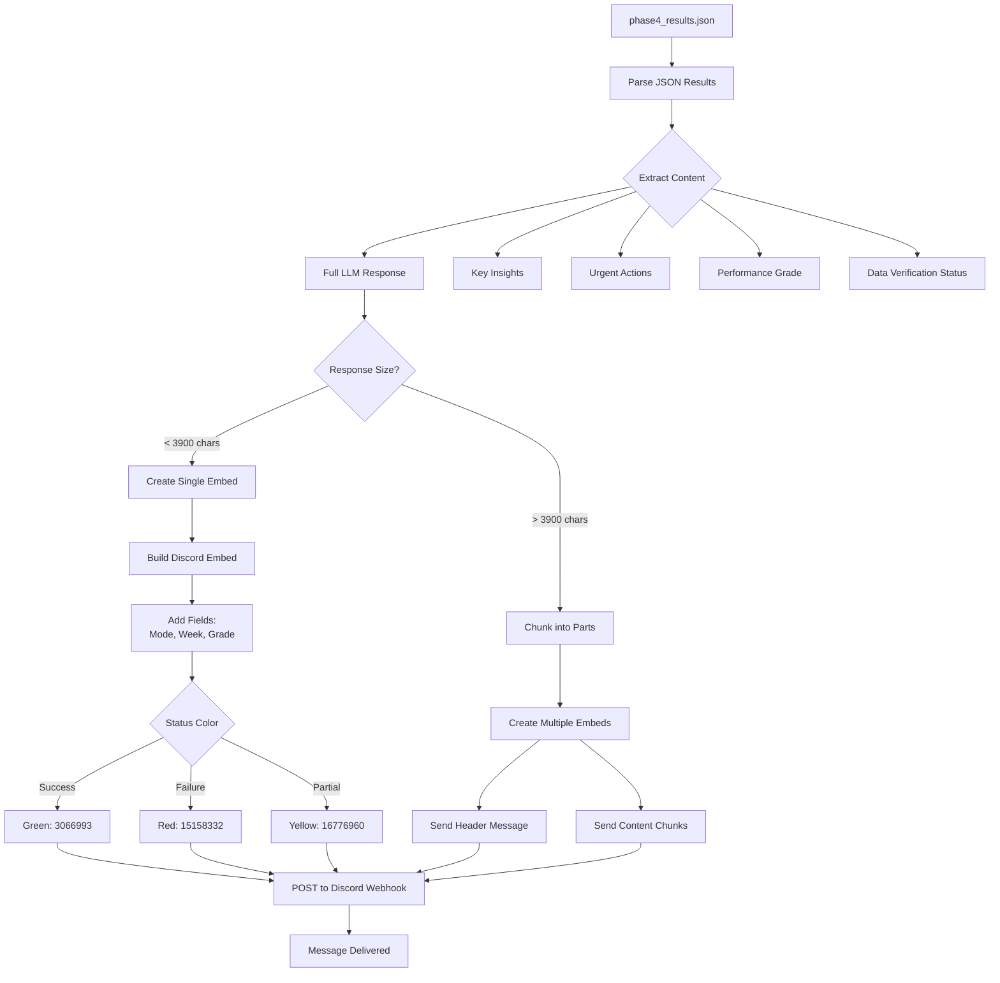
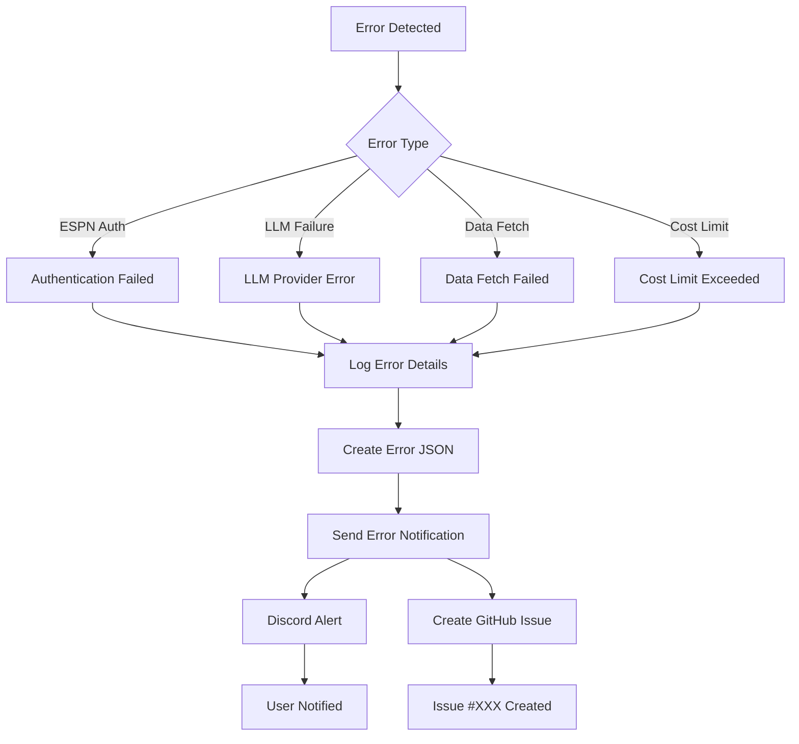

# ESPN Fantasy Football AI - Complete System Flow

## Overview
This document illustrates the complete flow from GitHub Actions triggers through LLM processing to Discord notifications for the ESPN Fantasy Football AI Manager.

## High-Level Architecture Flow



## Detailed Component Flows

### 1. GitHub Actions Trigger Flow



### 2. Data Collection Flow



### 3. LLM Processing Flow



### 4. Discord Notification Flow



### 5. Error Handling Flow



## Data Structures

### Input Configuration (GitHub Secrets)
```yaml
ESPN_S2: "long_cookie_string..."
ESPN_SWID: "{uuid-format-string}"
LEAGUE_1_ID: "12345678"
LEAGUE_1_TEAM_ID: "3"
GEMINI_API_KEY: "AIza..."
DISCORD_WEBHOOK_URL: "https://discord.com/api/webhooks/..."
```

### LLM Prompt Structure
```javascript
{
  mode: "full",
  week: 5,
  leagueData: {
    teams: [...],
    roster: [...],
    matchups: [...]
  },
  expertRankings: [...],
  instructions: "Analyze and provide recommendations..."
}
```

### Output Structure (phase4_results.json)
```javascript
{
  summary: [{
    league: "Main League",
    fullLLMResponse: "Complete analysis text...",
    insights: {
      key_insights: ["insight1", "insight2"],
      urgent_actions: ["action1"],
      performance_grade: "A"
    }
  }],
  data_verification: {
    espn_authenticated: true,
    llm_provider: "gemini",
    llm_model: "gemini-2.0-flash-exp"
  }
}
```

### Discord Message Structure
```javascript
{
  embeds: [{
    title: "🧠 Phase 4 Advanced Intelligence - ✅ SUCCESS",
    description: "Full LLM analysis text...",
    color: 3066993,
    fields: [
      {name: "🎯 Intelligence Mode", value: "full", inline: true},
      {name: "📅 NFL Week", value: "5", inline: true},
      {name: "🏆 Performance Grade", value: "A", inline: true}
    ],
    footer: {text: "Fantasy AI Phase 4 • Nov 15, 2024"},
    timestamp: "2024-11-15T12:00:00Z"
  }]
}
```

## Key Integration Points

1. **GitHub Actions → Node.js CLI**: Workflow executes `cli.js` with mode parameters
2. **CLI → ESPN API**: Authenticated requests using cookies from secrets
3. **CLI → LLM Provider**: Structured prompts sent via API (Gemini/Claude/OpenAI)
4. **LLM → Results JSON**: Parsed response saved to `phase4_results.json`
5. **Results → Discord**: Formatted embed messages sent via webhook

## Cost Management

The system implements multi-level cost controls:
- **Daily Limit**: $2.00 default
- **Weekly Limit**: $10.00 default  
- **Monthly Limit**: $35.00 default

When limits are exceeded, the system falls back to cheaper models or skips non-critical analysis.

## Performance Metrics

Typical execution times:
- **Preflight Check**: ~30 seconds
- **Data Collection**: 20-40 seconds
- **LLM Processing**: 15-30 seconds
- **Notification Sending**: 2-5 seconds
- **Total Workflow**: 2-3 minutes

## Security Considerations

1. **Secrets Management**: All sensitive data stored in GitHub Secrets
2. **Cookie Rotation**: ESPN cookies expire ~30 days, require manual update
3. **API Key Protection**: Keys never exposed in logs or artifacts
4. **Webhook Security**: Discord webhooks are write-only, can't read messages
5. **Error Sanitization**: Error messages sanitized before public display