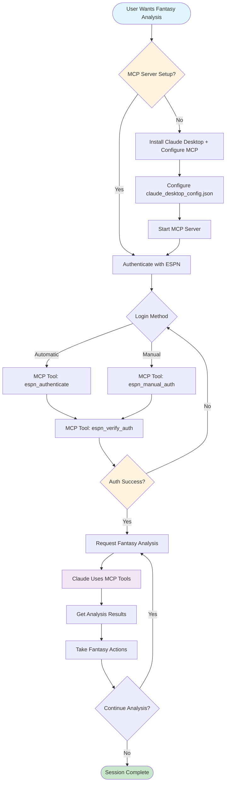
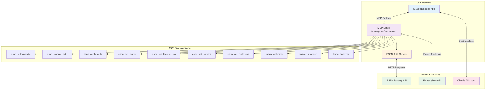
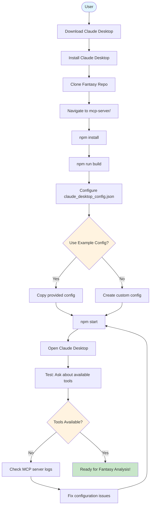
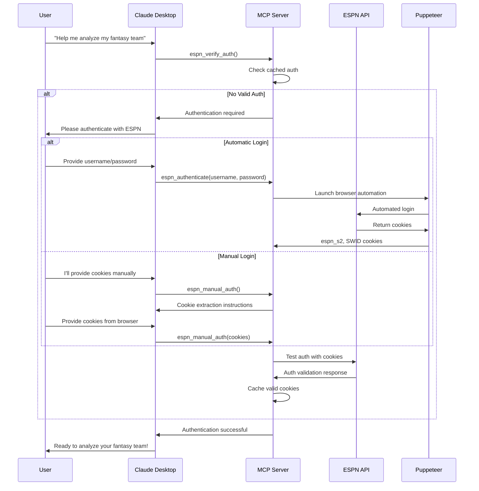
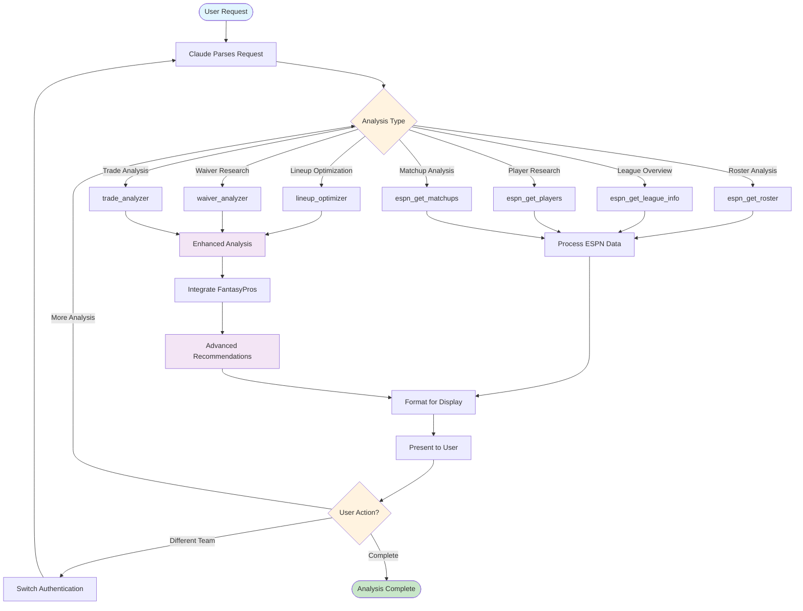
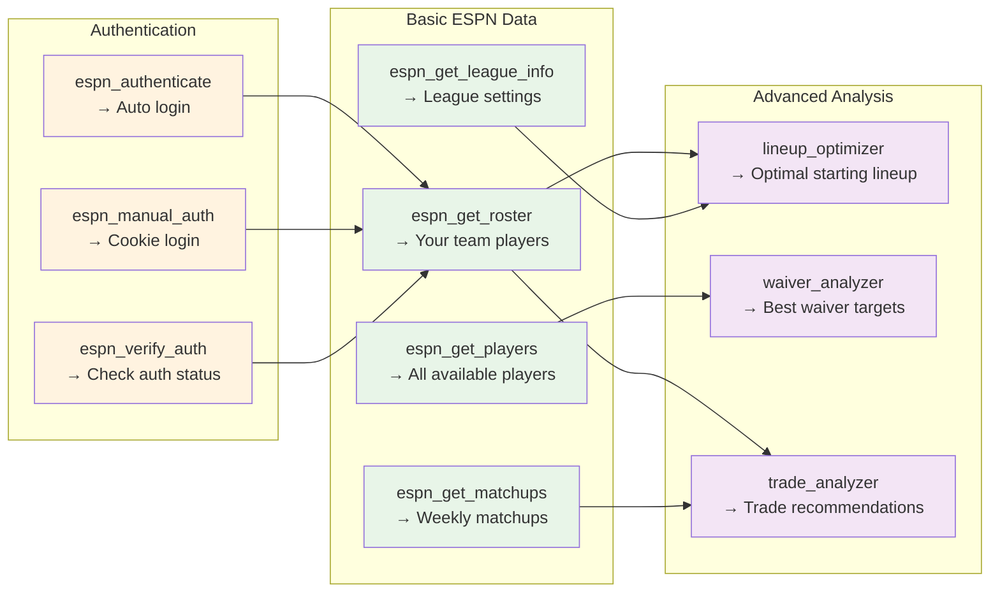
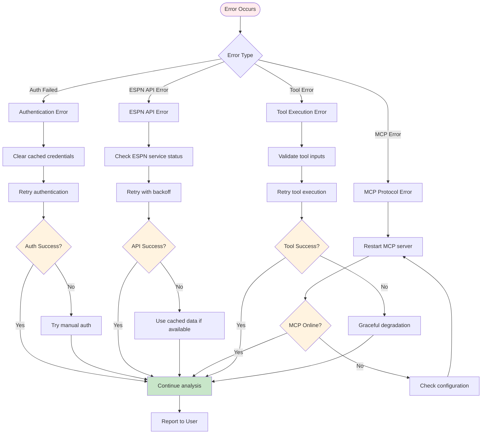
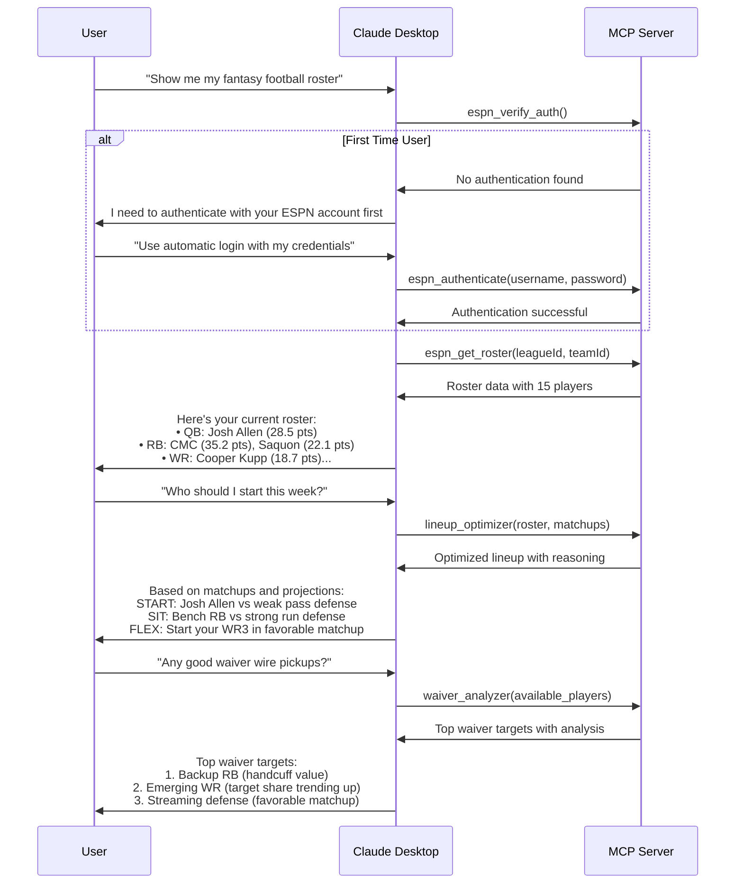

# Claude Desktop + MCP Server Integration Flowchart

This flowchart shows how to use the Fantasy Football AI system through Claude Desktop with the MCP (Model Context Protocol) server integration.

## Overview Flow



## Detailed Component Flow



## Setup Process Flowchart



## Authentication Flow



## Fantasy Analysis Workflow



## Tool Usage Examples



## Error Handling Flow



## Sample User Conversation Flow



## Configuration Files

### claude_desktop_config.json Example
```json
{
  "mcpServers": {
    "fantasy-football": {
      "command": "node",
      "args": ["dist/index.js"],
      "cwd": "/path/to/FantasyCoManager/fantasy-poc/mcp-server"
    }
  }
}
```

### Environment Variables
```bash
# Optional - for enhanced features
FANTASYPROS_API_KEY=your_key_here
GEMINI_API_KEY=your_gemini_key
OPENAI_API_KEY=your_openai_key
```

## Troubleshooting Decision Tree

```mermaid
graph TB
    Issue([Issue Occurred]) --> Category{Issue Category}
    
    Category -->|Setup| SetupIssue[MCP server not starting]
    Category -->|Auth| AuthIssue[ESPN authentication failing]
    Category -->|Tools| ToolIssue[Tools not available in Claude]
    Category -->|Data| DataIssue[No data returned]
    
    SetupIssue --> CheckNode[Check Node.js version ≥16]
    CheckNode --> CheckBuild[Run npm run build]
    CheckBuild --> CheckConfig[Verify claude_desktop_config.json]
    CheckConfig --> Restart[Restart Claude Desktop]
    
    AuthIssue --> CheckCookies[Verify ESPN cookies are fresh]
    CheckCookies --> TryManual[Try manual authentication]
    TryManual --> ClearCache[Clear authentication cache]
    
    ToolIssue --> CheckMCP[Verify MCP server is running]
    CheckMCP --> CheckLogs[Check MCP server logs]
    CheckLogs --> ConfigPath[Verify config file path]
    
    DataIssue --> CheckIDs[Verify League/Team IDs]
    CheckIDs --> CheckSeason[Verify current season (2025)]
    CheckSeason --> TestAPI[Test ESPN API directly]
    
    Restart --> Resolved{Resolved?}
    ClearCache --> Resolved
    ConfigPath --> Resolved
    TestAPI --> Resolved
    
    Resolved -->|No| Support[Check GitHub Issues]
    Resolved -->|Yes| Success[Ready to use!]

    style Issue fill:#ffebee
    style Resolved fill:#fff3e0
    style Success fill:#c8e6c9
```

---

## Key Benefits of MCP Integration

1. **Direct Integration**: No web interface needed - works directly in Claude Desktop
2. **Real-time Data**: Live ESPN data fetched on demand
3. **Context Preservation**: Claude remembers your league context across conversation
4. **Advanced Analysis**: Combines multiple data sources (ESPN + FantasyPros + AI)
5. **Secure Authentication**: Credentials stored locally, not in cloud
6. **Extensible**: Easy to add new fantasy analysis tools

## Getting Started

1. **Install Claude Desktop** from Anthropic
2. **Clone this repository** to your local machine
3. **Set up the MCP server** following the setup flowchart
4. **Configure Claude Desktop** with the MCP server
5. **Start analyzing your fantasy team** through natural conversation!

The MCP integration transforms Claude Desktop into a powerful fantasy football analysis tool with direct access to your ESPN data and advanced AI recommendations.